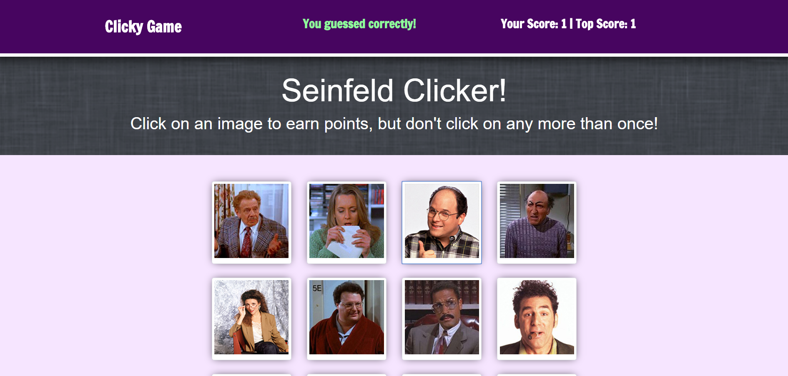

# ReactJS "Seinfeld Clicker" Game  

[View Live!](https://fast-mesa-69100.herokuapp.com/)

## Brief Description

The **ReactJS "Seinfeld Clicker" Game** uses the Front-End framework **ReactJS** & displays a grid filled with images of various Seinfeld characters, which users can click. After the user clicks an image, the order of the images is shuffled, and the user is supposed to keep clicking various images without guessing one that has already been clicked on. Each time the user clicks on a new, previously unclicked image, a point is added to their score. The goal is to get up to 12 points by clicking on all 12 different characters without repeating any clicks.

## How This Was Achieved  

As most **React** apps, this game is composed of many components. The **smart component** that handles the majority of the logic for the game, as well as changes in **state**, is "App.js". The initial state of the app when the game begins contains default values for several different properties, including the "score", the "top score", the "instruction message", the empty array "imgsClicked" (which will be populated by images as they are guessed by the user, and will be used to make sure that the user doesn't click an image that they have already guessed), and an array that holds references to all of the imported image files.

There is a method within App.js that is used to handle what happens after an image is clicked. When an image is clicked, its "src" attribute is determined using "event.target" (since each image is displayed as an Input element with type="image"). The method then checks whether or not this is the first time that this particular image was clicked during the current round of gameplay. If it is, then the state is updated to reflect that a point has been added to the "score" property, the instruction message in the state is replaced with a success message, and the image that was just clicked is added to the "imgsClicked" array so that the names of future clicked images can be compared against this one to make sure that it's not being guessed twice. In addition, a **conditional statement** is run to check whether the new score is greater than or equal to the current Top Score. If it is, that means that a new Top Score has been reached, so a point is added to the Top Score property in the state. 

If, after checking whether the currently clicked image is a duplicate of an image that has already been guessed in the current round, it turns out that the image is, in fact, a repeat, then the score is reset to 0, the "message" property in the state is changed to display a fail message, and the imgsClicked array is emptied out, in order to restart the game and allow the user to start guessing images for a new round of gameplay. 

Whether it turns out that the user has guessed a repeat image or not, the "images" array in the state is shuffled using another method, which is called "reShuffle". The "Main.js" component, which is connected to the "App.js" component & is used to display the actual images on the page, is passed in the entire array as a prop. The "src" attribute for each image on "Main" is not a direct source based on the name of a particular image; instead, it references the images array ("props.images[0]", for example, which is simply saying that the image in question should be the first image from the images array). Therefore, when the order of the array is shuffled, the images displayed on the page automatically switch to reflect the new order.

The "handleImgClick" method is also passed down to the "Main" component as a prop and is referenced by the "onClick" property of each input element. Meanwhile, back on the "App.js" component, the **JSX** code that is rendered contains the Front-End structure of the overall application. This involves the usage of various other components, such as the "Header.js" componenent, which is passed in the "score", "top score", and "message" properties from the state, in order for it to be able to display their values for users, the "Hero.js" component, which is basically just a banner image spanning the width of the whole page, with intro text on it, the "Footer.js" component, and various **Bootstrap** related components, such as "Col.js" & "Row.js", which just handle the app's layout. 

Finally, the entire "App.js" component is exported, and the React default file "index.js" uses **ReactDOM** to render that component on the "index.html" page, which is the homepage of the entire game.